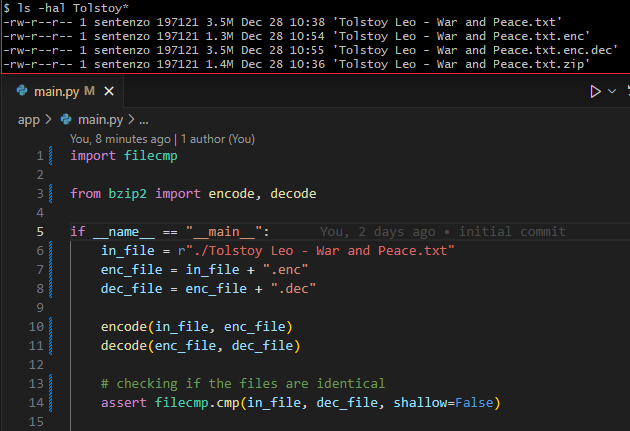

<h1>bzip2</h1>

This project is my implementation of **bzip2** 
([wiki](https://en.wikipedia.org/wiki/Bzip2)) — a popular and efficient 
data compression algorithm.




- [Features](#features)
- [Disclaimer](#disclaimer)
- [Project overview](#project-overview)
- [Algorithm specification](#algorithm-specification)
  - [Splitting into blocks](#splitting-into-blocks)
  - [Run-length encoding](#run-length-encoding)
  - [Burrows-Wheeler transform](#burrows-wheeler-transform)
  - [Move-to-front transform](#move-to-front-transform)
  - [Huffman coding](#huffman-coding)
  - [Merging the blocks](#merging-the-blocks)
- [Project infrastructure](#project-infrastructure)
  - [Software requirements](#software-requirements)
  - [How to launch](#how-to-launch)
  - [How to setup developer environment](#how-to-setup-developer-environment)
- [Licensing](#licensing)

## Features
 - a pure Python (`>=3.10`) implementation with no third-party dependencies
 - it outperforms (slightly) the standard zip-algorithm
 - it works with binary data, therefore no file-type restrictions

---


## Disclaimer
Though the code presented is fully functional, passes all the tests and has 
notable compression efficiency, the following should be taken into account:
- it's a pet project — it was **never meant to be used in production**
- the file binary structure is incompatible with the original bzip2 format 
(= can't be opened with an archive manager app)
- no consistency check (conversely to bzip canonical implementation)
- optimization leaves much to be desired due to a variety of factors:
  - it's written on pure Python
  - algorithm parameters are not fine-tuned enough
- only works with single files (so to compress a folder you have to tar it first)

## Project overview

The project files can be roughly groupt into three cathegories:
1. The implementation itself
2. Infrostructure (`Makefile`, `main.py`, settings, tests)
3. Extended documentation (all the `README.md` files)

## Algorithm specification

bzip2 algorithm can be described as a chain of reversible transformations:

1. Splitting into blocks
2. **RLE**
3. **BWT**
4. **MTF**
5. **RLE**
6. **HFC**
7. Merging the blocks

where:
| term    | wiki                                                                    | description               | specification                                  |
| ------- | ----------------------------------------------------------------------- | ------------------------- | ---------------------------------------------- |
| **RLE** | [link](https://en.wikipedia.org/wiki/Run-length_encoding)               | run-length encoding       | [README.md](app/transformations/rle/README.md) |
| **BWT** | [link](https://en.wikipedia.org/wiki/Burrows%E2%80%93Wheeler_transform) | Burrows-Wheeler transform | [README.md](app/transformations/bwt/README.md) |
| **MTF** | [link](https://en.wikipedia.org/wiki/Move-to-front_transform)           | move-to-front transform   | [README.md](app/transformations/mtf/README.md) |
| **HFC** | [link](https://en.wikipedia.org/wiki/Huffman_coding)                    | Huffman coding            | [README.md](app/transformations/hfc/README.md) |

So, to encode (and compress) the file we apply the transformations from the list sequentially.

Thus to decode the file, one should apply the inverse transformations in inverse order.


### Splitting into blocks

The `Splitting into blocks` step is just making an inerator based on the file descriptor given. 
This iterator yields byte-blocks of a fixed size.

### Run-length encoding
See: [RLE README.md](app/transformations/rle/README.md)

### Burrows-Wheeler transform
See: [BWT README.md](app/transformations/bwt/README.md)

### Move-to-front transform 
See: [MTF README.md](app/transformations/mtf/README.md)

### Huffman coding
See: [HFC README.md](app/transformations/hfc/README.md)

### Merging the blocks

`Merging the blocks` is a little bit trickier. The final block size is indetermined, 
so we have to store it somewhere. Otherwise we won't be able to reverse this operation.
The binary format is as follow:

```
 0               1               2               3
 0 1 2 3 4 5 6 7 8 9 A B C D E F 0 1 2 3 4 5 6 7 8 9 A B C D E F
+-+-+-+-+-+-+-+-+-+-+-+-+-+-+-+-+-+-+-+-+-+-+-+-+-+-+-+-+-+-+-+-+
|                  1st block size (4 bytes)                     |
+-+-+-+-+-+-+-+-+-+-+-+-+-+-+-+-+-+-+-+-+-+-+-+-+-+-+-+-+-+-+-+-+
|                                                               |
|                1st block data (up to 4 GiB)                   |
|                                                               |
+-+-+-+-+-+-+-+-+-+-+-+-+-+-+-+-+-+-+-+-+-+-+-+-+-+-+-+-+-+-+-+-+
|                  2nd block size (4 bytes)                     |
+-+-+-+-+-+-+-+-+-+-+-+-+-+-+-+-+-+-+-+-+-+-+-+-+-+-+-+-+-+-+-+-+
|                                                               |
|                2nd block data (up to 4 GiB)                   |
|                                                               |
+-+-+-+-+-+-+-+-+-+-+-+-+-+-+-+-+-+-+-+-+-+-+-+-+-+-+-+-+-+-+-+-+
|                                                               |
|                             ...                               |
|                                                               |
+-+-+-+-+-+-+-+-+-+-+-+-+-+-+-+-+-+-+-+-+-+-+-+-+-+-+-+-+-+-+-+-+
```

## Project infrastructure

### Software requirements

- [`Python >=3.10`](https://www.python.org/downloads/)
- (potional) [`make`](https://en.wikipedia.org/wiki/Make_(software)) tool — for build-automation

### How to launch

1. Choose a file you want to compress and copy its path to the clipboard. 
2. Paste it into the `in_file` variable in `main.py`.
3. Run `main` from the project root folder.
   - or just run `python app/main.py`

### How to setup developer environment

- `pip install -r requirements.dev.txt` — to install all the dev dependencies
- `make lint` — for formating and linting (`isort` => `black` => `flake8` )
- `make test` — to run fast tests
- `make test-all` — to run all the tests (incloding the slow ones)


## Licensing
[MIT License](./LICENSE)