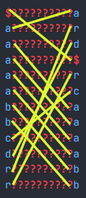
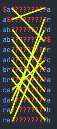

<h1>Burrows-Wheeler transform</h1> 


- [Abstract](#abstract)
- [Naive implementation](#naive-implementation)
  - [Encoding](#encoding)
    - [Side notes](#side-notes)
  - [Decoding](#decoding)
    - [Side notes](#side-notes-1)
- [More efficient implementation](#more-efficient-implementation)
  - [1. we need to do something with the `$` character.](#1-we-need-to-do-something-with-the--character)
  - [2. `O(N^2)` space complexity is unacceptable](#2-on2-space-complexity-is-unacceptable)
  - [3. `O(N^3 log N)` time complexity to restore the rotation table (decoding) is unacceptable](#3-on3-log-n-time-complexity-to-restore-the-rotation-table-decoding-is-unacceptable)
- [Specification](#specification)


## Abstract

Burrows-Wheeler transform (**BWT**) is a special permutation of the initial sequence of bytes.
Therefore it's reversible and doesn't change the size of the sequence.


BWT can be useful, because after this permutation similar bytes tend to be located closer to each other. This improves performance of some compression algorithms.

## Naive implementation

### Encoding

Let's transform some string. Let it be `"abracadabra"`. We'll also mark the and of the string with a special symbol: `"abracadabra$"`.

Let's then generate all the rotations of this string:

```python
abracadabra$
bracadabra$a
racadabra$ab
acadabra$abr
cadabra$abra
adabra$abrac
dabra$abraca
abra$abracad
bra$abracada
ra$abracadab
a$abracadabr
$abracadabra
```

Now let's sort them alphabetically:
```python
           ↓
$abracadabra
a$abracadabr
abra$abracad
abracadabra$
acadabra$abr
adabra$abrac
bra$abracada
bracadabra$a
cadabra$abra
dabra$abraca
ra$abracadab
racadabra$ab
           ↑
```

The last column of this table of symbols is the encoded string:
`ard$rcaaaabb`.

So, `bwt.encode("abracadabra$") → "ard$rcaaaabb"`.

#### Side notes
- the table of symbols is actually square-shaped
    - so, it takes `O(N^2)` memory — not cool 🙁
- obvious: each **row** contains all the characters of the initial string
- less obvious: each **column** contains all the characters of the initial string

### Decoding
Here's a string `"ard$rcaaaabb"`. How to decode it?

Well, we know it was the last column of the table:
```python
???????????a
???????????r
???????????d
???????????$
???????????r
???????????c
???????????a
???????????a
???????????a
???????????a
???????????b
???????????b
```
What else do we know:
- the rows of the table are sorted alphabetically
- each column contains all the characters of the initial string

These two facts allow us to restore the first column:
```python

sorted("ard$rcaaaabb") → "$aaaaabbcdrr"

$??????????a
a??????????r
a??????????d
a??????????$
a??????????r
a??????????c
b??????????a
b??????????a
c??????????a
d??????????a
r??????????b
r??????????b

```

Now, having the first and the last columns we know all the sequential pairs from the initial string.

> #### Detailed explanation
> Let's look at the first row: `$??????????a`. 
> 
> We only know its first and last symbols. We also know it's some rotation of the initial string. Which means somewhere in the initial string there's a symbol `a` followed by `$`.
> 
> So, now we know `"a$" in init_str == True`.
> 
> This line of reasoning works for all the other rows, except for `a??????????$`, because the `$a` pair can't be found in `abracadabra$`. Yet it is present in its rotation: `dabra[$a]braca`.

The sequential pairs in their turn can also be sorted:
```python

sorted(["a$","ra","da","$a","ra","ca","ab","ab","ac","ad","br","br"])
↓
["$a","a$","ab","ab","ac","ad","br","br","ca","da","ra","ra"]
```

And in this exact order they should be presented as the table rows prefixes:
```python
$a?????????a
a$?????????r
ab?????????d
ab?????????$
ac?????????r
ad?????????c
br?????????a
br?????????a
ca?????????a
da?????????a
ra?????????b
ra?????????b
```

Now, knowing first, second and last column, we can generate all the sequential triplets, sort them and get the third column.

Repeating this process iteratively will eventually give us all the columns of the symbols table. The decoded string will be the one ending with the `$` sign.

#### Side notes
- each iteration requires a sorting procedure over `N` strings with `O(N)` characters each
    - if we compare to strings in `O(N)`, than the time complexity will be `O(N^2 log(N))` — so slow 😢
    - the total time complexity on `N` iterations will be `O(N^3 log(N))` — 😲
- if we don't use `$` to mark the end of the string, it's impossible to recover the initial string
    - we can't say if it was `abracadabra` or `adabraabra` or any other rotation

## More efficient implementation
### 1. we need to do something with the `$` character.

Why so? Because **we work with binary data — not strings**. We can't just mark the end of the initial sequence with `$`. Because this symbol (as any other byte) can be the part of the sequence

The `$` sign from naive implementation was actually a **сontrol character** — it had its meaning in the context of encoding algorithm.

We could solve it with implementing some escape sequences standards (like we have it in strings with `\` and `\\` symbols). But the easier way to go is to store the pointer to the original row.

```python
init_str = "zeal"

# Rotations:
zeal ←
ealz 
alze 
lzea 

# Sorted rotations:
alze   0
ealz   1
lzea   2
zeal ← 3

encoded_str = "ezal"
last_char_position = 3
```

`encoded_str` and `last_char_position` are enough to restore `init_str`.

### 2. `O(N^2)` space complexity is unacceptable

`O(N^2)` space complexity emerges from naive implementation when you build the rotations table: the initial block size is `N` bytes, and you generate `N` rotations of this block.

A rotation table of a `32 KiB` block will be:
```
(2**5 * 1 KiB)**2 = (2**15)*2 = 2**30 = 1 GiB
```
 — `1 GiB` — that's ridiculous.
 
Fortunately, we don't have to build the rotations. We can generate them dynamically from their rotation shifts. It goes as follow:

```python
data = ...
size = len(data)

class Rotation:
    def __init__(self, shift) -> None:
        self.shift = shift

    def __getitem__(self, index):
        return data[(index + self.shift) % size]

rotations = [Rotation(i) for i in range(size)]
```

Thus, space complexity becomes `O(N)`.

### 3. `O(N^3 log N)` time complexity to restore the rotation table (decoding) is unacceptable

`O(N log(N))` — is efficient sort algorithm time complexity **on fixed-sized elements**. But we are trying to sort arbitrary long chunks of data, so is without optimization it turns into `O(N^2 log N^2 ) == O(N^2 log N)`.

We apply sorting algorithm `N` times, so it becomes `O(N^3 log N)`.

That means, if one operation takes `1 ns` to process, to decode a `32 KiB` block we'll spend ≈ `9.8 hours`. That's insane.

How to optimize it?

Let's recollect what we know about decoding.
```python

sorted("ard$rcaaaabb") → "$aaaaabbcdrr"

# Column 1 restored:

$??????????a
a??????????r
a??????????d
a??????????$
a??????????r
a??????????c
b??????????a
b??????????a
c??????????a
d??????????a
r??????????b
r??????????b
```

This is how each symbol of the last column permutates:



```python

sorted(["a$","ra","da","$a","ra","ca","ab","ab","ac","ad","br","br"])
↓
["$a","a$","ab","ab","ac","ad","br","br","ca","da","ra","ra"]

# Column 2 restored:

$a?????????a
a$?????????r
ab?????????d
ab?????????$
ac?????????r
ad?????????c
br?????????a
br?????????a
ca?????????a
da?????????a
ra?????????b
ra?????????b
```

This is how each pair permutates after we sort it:



The resemblance is evident. When we sort prefixes on each iteration, it's actually the **same permutation**.

The optimized decoding algorithm looks like this:
1. Build the permutation by sorting the encoded sequence (`O(N log N)`)
2. Recover the initial data (`O(N)`)
```python
data_size = len(data)

# 1
permutation = list(range(data_size))
permutation = sorted(permutation, key=lambda i: data[i])

# 2
position = last_char_position
init_data = [None] * data_size

for i in range(data_size):
    position = permutation[position]
    init_data[i] = data[position]
```

Total time complexity: `O(N log N)`

## Specification

`last_char_position` has to be stored in the encoded block. So we put it at the beginning. The size is fixed and equal to 4 bytes.

```
 0               1               2               3
 0 1 2 3 4 5 6 7 8 9 A B C D E F 0 1 2 3 4 5 6 7 8 9 A B C D E F
+-+-+-+-+-+-+-+-+-+-+-+-+-+-+-+-+-+-+-+-+-+-+-+-+-+-+-+-+-+-+-+-+
|                last_char_position (4 bytes)                   |
+-+-+-+-+-+-+-+-+-+-+-+-+-+-+-+-+-+-+-+-+-+-+-+-+-+-+-+-+-+-+-+-+
|                                                               |
|                                                               |
|                                                               |
|                  encoded data (up to 4 GiB)                   |
|                                                               |
|                                                               |
|                                                               |
+-+-+-+-+-+-+-+-+-+-+-+-+-+-+-+-+-+-+-+-+-+-+-+-+-+-+-+-+-+-+-+-+
```